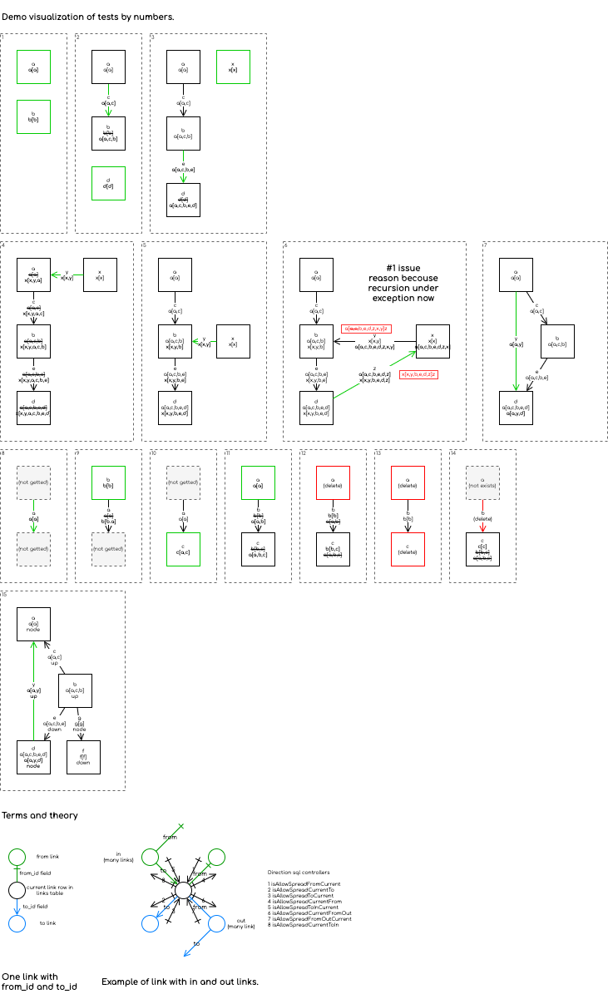

# deep-foundation materialized-path

[](https://badge.fury.io/js/%40deep-foundation%2Fmaterialized-path) 



Associative, multidirectional, multiparental materialized-path realization.

> To understand how to use it for your own purposes - look at migrations and tests.

- [x] Associative links structure base trigger table.
- [x] Column names configuration. You can use your structure, not only id/from_id/to_id with Trigger class options: `id_field`, `to_field`, `from_field`.
- [x] Multiparental. Any count of parent links in your trees, not only one.
- [x] Multidirectional. Not only from => to direction. You can has many trees with many links with many directions with Trigger class options: `isAllowSpreadFromCurrent`, `isAllowSpreadCurrentTo`, `isAllowSpreadToCurrent`, `isAllowSpreadCurrentFrom`, `isAllowSpreadToInCurrent`, `isAllowSpreadCurrentFromOut`, `isAllowSpreadFromOutCurrent`, `isAllowSpreadCurrentToIn`. See multidirectional migrations and tests for details.
- [x] Customizable id field type with Trigger class option: `id_type`.
- [x] **PostgreSQL only for now.**
- [x] Hasura support, but not required.
- [x] Grouping support. Not only one tree layer for one storage. You can separate multiple tree conditions with Trigger class options: `iteratorInsertDeclare`, `iteratorInsertBegin`, `iteratorInsertEnd`, `iteratorDeleteArgumentSend`, `iteratorDeleteArgumentGet`, `iteratorDeleteDeclare`, `iteratorDeleteBegin`, `iteratorDeleteEnd`, `groupInsert`, `groupDelete`, `additionalFields`, `additionalData`.
- [ ] [Benchmarks.](https://github.com/deep-foundation/materialized-path/issues/6)

## example

Install and run docker and npm. And then in this repo directory:

```
npm ci;
npm run hasura;
npm run migrate;
npm run test;
npm run unmigrate;
```